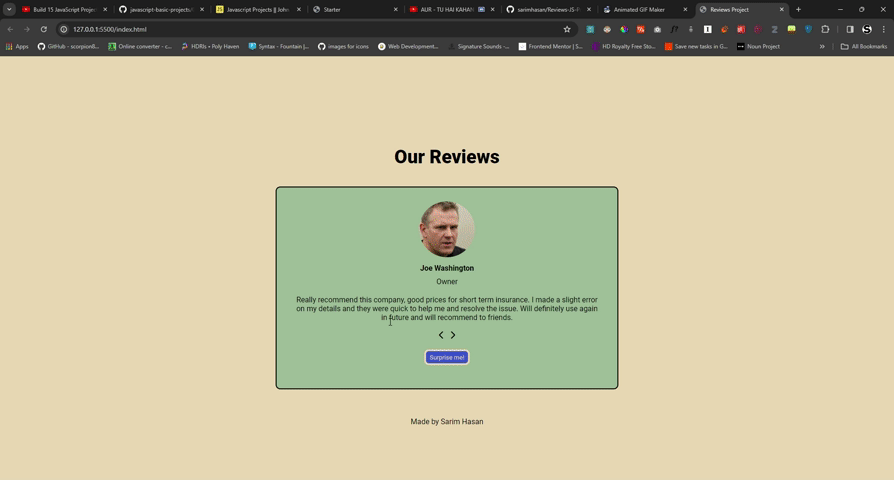

# slider Testimonials basic app with JS

## How to test the app

- download the repository by using this command or click on the download zip button under the "code" drop down menu
  ```
  git clone https://github.com/sarimhasan/Reviews-JS-Project.git
  ```
- start the live server in VSCode or open the html file directly
- Enjoy 🎉

## Here's a demo



## Functionality

- A surprise me button that generates a random number to show a random review
- The 2 prev and next buttons
- Auto sliding capability coming soon
